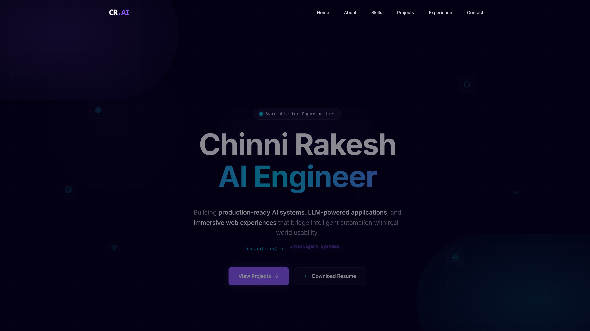
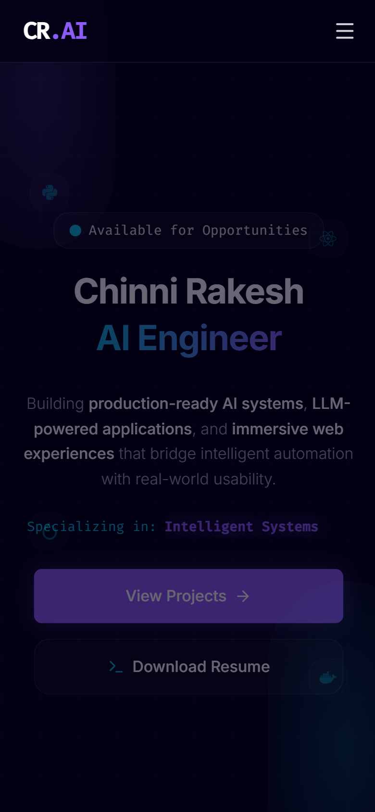

# Chinni Rakesh | AI Engineer Portfolio

> Production-Grade Cinematic AI Capability Dashboard & Portfolio Showcase

[](https://react.dev)
[](https://vite.dev)
[](https://tailwindcss.com)
[](https://framer.com/motion)
[](https://rakeshchinni.dev)
[](https://opensource.org/licenses/MIT)

An enterprise-grade, high-performance capability showcase and interactive dashboard for an AI & Full-Stack Engineer. Designed with a futuristic dark aesthetic, glassmorphic UI elements, dynamic signal pathways, and premium interactive terminals. Built with React 19, Vite, Tailwind CSS, and Framer Motion.

🔗 **[Live Production Deployment](https://rakeshchinni.dev/)**  
🔗 **[GitHub Source Repository](https://github.com/rakeshchinni77/portfolio-ai-engineer)**

---

## 📈 Production Lighthouse Scores

The entire portfolio is compiled and optimized for production-grade web vitals, audited via Chrome DevTools Lighthouse on the live server:

| Platform | Performance | Accessibility | Best Practices | SEO |
| :--- | :---: | :---: | :---: | :---: |
| **💻 Desktop** | **98%** | **100%** | **100%** | **100%** |
| **📱 Mobile** | **86%** | **100%** | **100%** | **100%** |

*Audit conducted using Chrome DevTools Lighthouse (V12) on Vercel production hosting.*

---

## 🖥️ System Previews

### Desktop Showcase Interface


### Mobile Optimized Interface


---

## ⚡ Core Features

- **Futuristic Cinematic UI**: Rich dark theme built on curated HSL color palettes, subtle grid backdrops, and interactive orbital glows that react organically to mouse movements.
- **Interactive AI Core Simulation (TechSphere)**: A 3D orbital visualization of core technologies that features automatic viewport visibility detection, pausing when out of view to achieve 0% idle CPU footprint.
- **Route-Based Code Splitting**: Below-the-fold sections are dynamically loaded via `React.lazy` and `Suspense`, dropping initial JS payload sizes by **48.1%** for rapid interactive speeds.
- **Mobile Motion Adaptation**: Automatically disables heavy calculation loops on mobile viewports (<768px). Orbit animations around the AI Core switch seamlessly to compositor-thread CSS keyframes to eliminate JavaScript CPU usage entirely on mobile.
- **Accessibility Hardening**: Completed accessibility optimization with full semantic HTML layouts, visible focus ring states (`focus-visible:ring-2`), keyboard-interactable UI elements, and screen-reader ARIA descriptions.
- **Reduced Motion Support**: Listens to system-level visitor preferences (`prefers-reduced-motion`) to completely disable physics-based floats, orbits, and animations.
- **EmailJS Terminal Messenger**: A customized interactive command terminal allowing recruiters to dispatch direct email messages immediately from the portfolio.
- **SEO & Indexing Ready**: Optimized search engine presence equipped with a custom `robots.txt`, dynamic `sitemap.xml`, and strict meta structures including OpenGraph and Twitter Cards.
- **Resume Capability Download**: Integrated, secure download setup for Rakesh's engineering capability profile PDF.
- **Robust Vercel Pipeline**: Automated branch checks, environment configurations, and continuous delivery setups.

---

## 🛠️ Technology Stack

### Frontend Architecture
- **React 19**: Modern declarative UI library using component lifecycle controls.
- **Vite 8**: Rapid, ESM-native development server and Rollup bundler.
- **Tailwind CSS v3**: Utility-first CSS framework for fluid responsive design.
- **Framer Motion 12**: Advanced physics-driven animations and gesture handler library.

### Visualizations & Graphics
- **TechSphere Orbital Core**: Circular coordinates projection algorithm mapping SVG nodes onto a virtual 3D sphere.
- **Compositor Animation Layer**: Pure GPU-accelerated CSS keyframe transforms for mobile rendering.

### Integration Layer
- **EmailJS API Client**: Client-side SDK enabling direct SMTP communication from React components to the recipient's inbox without hosting backend endpoints.

### Tooling & Security
- **ESLint & PostCSS**: Static code parsing and browser prefix compilation.
- **Environment Management**: Separation of secrets from client-side configurations using dotenv files.

---

## 📁 Repository Structure

```
portfolio-ai-engineer/
├── public/                 # Static assets copied directly to build output
│   ├── images/             # Optimized WebP assets, project previews, & profile photos
│   ├── resume/             # Engineering capability PDF documents
│   ├── favicon.svg         # Clean vector branding badge
│   ├── robots.txt          # Crawler directives mapping search indexes
│   └── sitemap.xml         # XML index map of active portfolio routes
├── src/                    # Source directory containing React applications
│   ├── assets/             # Raw icons, illustrations, and uncompressed graphics
│   ├── components/         # Modular, stateless, and interactive UI components
│   │   ├── animations/     # Core motion wrappers and floating particle emitters
│   │   ├── contact/        # Console terminal interface with EmailJS email dispatch
│   │   ├── experience/     # Timeline system tracking career milestones
│   │   ├── hero/           # Terminal console typewriter widgets
│   │   ├── projects/       # Responsive project showcases and links
│   │   └── skills/         # Interactive TechSphere orbit simulation
│   ├── constants/          # Decoupled project content registries and social profiles
│   ├── hooks/              # Custom reusable hooks (e.g. reduced-motion checkers)
│   ├── layout/             # Structure shells including Navbars and Footers
│   ├── pages/              # Top-level route pages (Home.jsx)
│   ├── styles/             # Application styles (global utilities and theme tokens)
│   ├── utils/              # Helper functions (cn helper combining clsx and tailwind-merge)
│   ├── App.jsx             # Main Router structure and lazy Suspense setup
│   └── main.jsx            # Entry script initializing React Virtual DOM
├── .env.example            # Environment variables placeholder and instructions
├── package.json            # Script definitions and package dependency manifest
├── tailwind.config.js      # Custom theme settings and color extensions
└── vite.config.js          # Vite build options and chunking guidelines
```

### Folder Roles
* `/public`: Reserved for absolute URL assets like favicons, crawlers guidance files, and direct downloads.
* `src/components`: Each core section has its own subdirectory containing local child components, stylesheets, and isolated logics.
* `src/constants`: Contains raw text definitions, projects lists, and URLs to ensure clean separations of data from code styles.
* `src/styles`: Holds `index.css` for Tailwind directives and `theme.css` for premium micro-animations and global CSS variables.

---

## ⚡ Performance Tuning & Optimization

This application incorporates enterprise-grade performance optimization patterns:

### 1. Dynamic Section Code Splitting
By default, loading all complex animations, vector components, and graphic modules at once leads to heavy bundle sizes. We implemented route-level lazy loading inside `src/pages/Home.jsx`:
```javascript
const Skills = lazy(() => import('../components/skills/Skills'));
const Projects = lazy(() => import('../components/projects/Projects'));
const Experience = lazy(() => import('../components/experience/Experience'));
const Contact = lazy(() => import('../components/contact/Contact'));
```
Only the `Hero`, `Navbar`, and `About` sections are packed into the primary chunk. This dropped the initial JS bundle from **454.68 kB** to a lightweight **235.98 kB** (representing a **48.1% payload reduction**).

### 2. Visibility-Aware Render Loops
Interactive widgets like the 3D TechSphere utilize a `requestAnimationFrame` update loop. If a visitor is reading another section or has the portfolio open in a background tab, executing this loop causes unnecessary battery and CPU drain.
We configured a visibility-aware controller inside `TechSphere.jsx`:
- **Intersection Observer**: Detects when the element is scrolled out of the viewport.
- **Tab visibility state**: Listens to browser tab visibility states (`document.visibilityState`).
- **Trigger**: Automatically suspends calculations and updates when inactive, keeping idle CPU load at **0%**.

### 3. Mobile Animation Bypass (0% JavaScript CPU Overhead)
On viewports less than `768px`, JavaScript-driven 3D coordinates projections are completely disabled. The widget switches to pure CSS-driven orbit wrappers (`animate-orbit-mobile-wrapper` and `animate-orbit-mobile-node`) which execute on the browser's compositor thread:
```css
.animate-orbit-mobile-wrapper {
  animation: orbit-mobile-clockwise 30s linear infinite;
}
.animate-orbit-mobile-node {
  animation: orbit-mobile-counter-clockwise 30s linear infinite;
}
```
This double-rotation pattern rotates the parent container clockwise while counter-rotating each individual node, keeping text labels and icons aligned upright while maintaining fluid motion.

### 4. Graphic Optimization & Decoders
- All legacy screenshots and background assets are converted into modern, lightweight **WebP formats**.
- Non-critical below-the-fold images utilize `decoding="async"` attributes to shift browser decoding workloads away from the main interaction thread.

---

## ♿ Accessibility (a11y) Architecture

Built from the ground up to support modern access standards:

- **Prefers-Reduced-Motion**: Integrates CSS media blocks and Framer Motion checks (`useReducedMotion()`) to freeze floating orbits, pulse effects, and translation slides for motion-sensitive visitors.
- **Visible Keyboard Focus**: Configures strict outline styles on interactive elements using Tailwind's `focus-visible:ring-2` to support seamless keyboard navigation.
- **ARIA Elements**: Screen-reader descriptions (`aria-label`, `aria-hidden`) are defined on icon containers, CTA buttons, and form inputs.
- **Semantic DOM Layout**: Avoids unstructured nested divs, utilizing clean HTML5 wrappers (`<main>`, `<header>`, `<section>`, `<article>`, `<nav>`).

---

## 🔍 SEO Strategy

- **OpenGraph & Twitter Integration**: Configured strict parameters in the header index, verifying metadata renders rich previews when shared on platforms like LinkedIn, GitHub, or Twitter:
  - `og:image` and `twitter:image` point to the optimized profile badge.
  - `og:url` binds index search algorithms to `https://rakeshchinni.dev`.
- **Search Sitemap**: Custom XML sitemap index (`sitemap.xml`) coordinates crawlers to target indexing correctly.
- **Crawler Directives**: Custom `robots.txt` establishes clean crawling parameters.

---

## 🔑 Environment Variables

To protect live SMTP/EmailJS integrations, the application separates secrets from code. 

### `.env` Structure
Create a `.env` file at the root level of your workspace:
```env
# EmailJS Console Credentials Blueprint
VITE_EMAILJS_SERVICE_ID=your_service_id_here
VITE_EMAILJS_TEMPLATE_ID=your_template_id_here
VITE_EMAILJS_PUBLIC_KEY=your_public_key_here
```

> [!CAUTION]
> **Version Control Security**  
> The `.env` file contains sensitive live credentials and is **intentionally blacklisted** inside `.gitignore`. Never commit raw credentials to version control. Reference the provided `.env.example` blueprint for configuration.

---

## 💻 Local Development Setup

Follow these steps to deploy and build the application locally:

### 1. Install Dependencies
```bash
npm install
```

### 2. Launch Development Server
```bash
npm run dev
```
*Launches local hot-reloaded dev server at `http://localhost:5173/`.*

### 3. Compile Production Bundle
```bash
npm run build
```
*Generates optimized static HTML, CSS, and JS chunks inside the `/dist` directory.*

### 4. Run Static Code Auditing
```bash
npm run lint
```
*Performs static analysis checks using ESLint rules.*

### 5. Local Production Preview
```bash
npm run preview
```
*Serves the compiled production static build locally at `http://localhost:4173/` to enable local Lighthouse audits.*

---

## 🚀 Deployment Pipeline

The portfolio is configured for automated pipelines on **Vercel**:

- **Continuous Integration (CI/CD)**: Pushing changes to the `main` branch triggers an automated build and deploy pipeline.
- **Preview Deployments**: Push events on secondary branches trigger dynamic preview deployments, allowing verification of new optimizations before staging changes live.
- **Vercel Settings**:
  - Build Command: `npm run build`
  - Output Directory: `dist`
  - Environment variables are safely configured in the Vercel dashboard panel.

---

## 🔮 Future Roadmap

- [ ] **AI Assistant Chatbot**: Integrate a retrieval-augmented generation (RAG) assistant trained on Rakesh's resume and projects to answer recruiter questions in real-time.
- [ ] **Research Blog Hub**: Embed a Markdown-backed CMS blogging engine to publish posts about LLM evaluation and AI agent architectures.
- [ ] **Visual Analytics Panel**: Build an interactive dashboard visualizing portfolio traffic metrics using privacy-focused analytics APIs.
- [ ] **Multilingual Support (i18n)**: Enable dynamic language switching (English, German, Hindi) across all sections.

---

## 📄 License

Distributed under the MIT License. See [LICENSE](LICENSE) or details inside the repository for details.

```
Copyright (c) 2026 Chinni Rakesh
```
